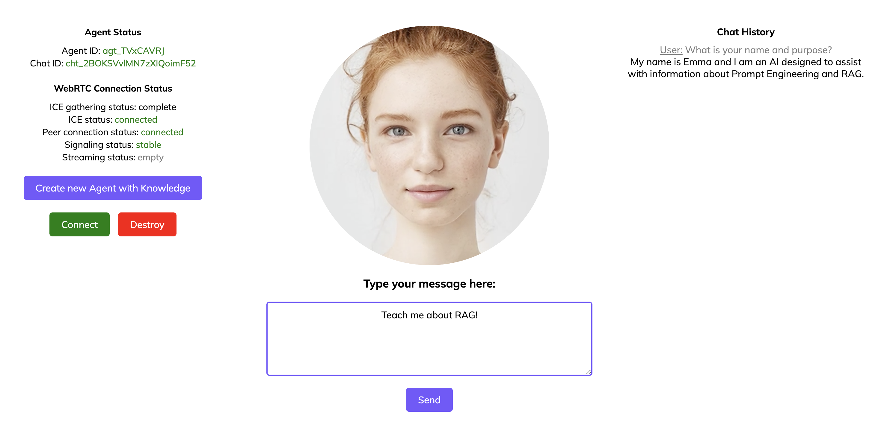

# Streaming Live Demo by D-ID

* (install express) Open a terminal in the folder and run - `npm install express`
* (add your API key) Edit the `api.json` inside the uncompressed folder and replace the emoji with your key
* (select service) in the same `api.json` file, edit the `service` field to choose your avatar type, use `talks` for an avatar made from an image or `clips` to use a premade HQ avatar from a video

## Start Streaming Demo:
* (bring up the app) in the folder (ctr left click on folder through finder) open the terminal run `node app.js`
* you should see this message - server started on port localhost:3000
* (open the app) In the browser add localhost:3000
* (connect) press connect you should see the connection ready 
* (stream) Press the start button to start streaming

## ⭐ Start Agents Demo [NEW!] ⭐
* (bring up the app) in the folder (ctr left click on folder through finder) open the terminal `run node app.js` 
* you should see this message - server started on port localhost:3000
* (open the app) In the browser add localhost:3000/agents
* press 'Create new Agent with Knowledge' to create a new Agent. All API endpoints' responses are visible in the console. 
* press 'Connect' to connect to the agent, once done, type a message and press 'Send' to start a chat
* you can store the created `agentId` and `chatID` variables and at the bottom of the `agents-client-api.js` file for future chats with your newly created Agent.

